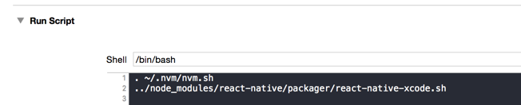

# React native 踩坑

## Cocopod 镜像

Cocopod 1.8 以后默认使用添加了 trunk

我们可以手动添加 master

```bash
cd ~/.cocoapods/repos 
$ git clone https://mirrors.tuna.tsinghua.edu.cn/git/CocoaPods/Specs.git master

pod install --verbose --no-repo-update
```

## 错误：Can't find 'node' binary to build React Native bundle

如果你使用的是 nvm 安装

根据下图配置即可



