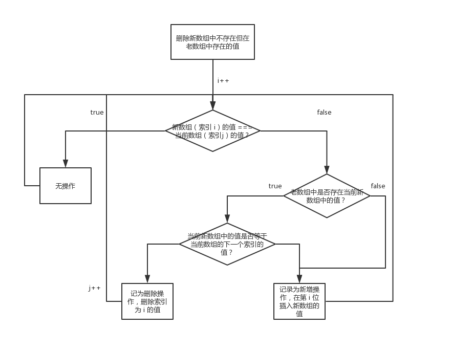

# 深入理解 Virtual DOM

## 为什么说浏览器的 DOM 操作很慢？

1. DOM 引擎、JS 引擎 相互独立，但又工作在同一线程（主线程）。
2. JS 代码调用 DOM API 必须 挂起 JS 引擎、转换传入参数数据、激活 DOM 引擎，DOM 重绘后再转换可能有的返回值，最后激活 JS 引擎并继续执行。
3. 若有频繁的 DOM API 调用，且浏览器厂商不做“批量处理”优化，引擎间切换的单位代价将迅速积累。
4. 若其中有强制重绘的 DOM API 调用，不但厂商费尽心机做的“批量处理”优化被中断，重新计算布局、重新绘制图像会引起更大的性能消耗所以，降低引擎切换频率、减小 DOM 变更规模才是评判各种 DOM 性能优化方案的关键！

所以，降低引擎切换频率、减小 DOM 变更规模才是评判各种 DOM 性能优化方案的关键！

> 作者：水歌
> 链接：https://www.zhihu.com/question/67479886/answer/283723030
> 来源：知乎
> 著作权归作者所有。商业转载请联系作者获得授权，非商业转载请注明出处。

## 为什么要使用 Virtual DOM？

* 通过 DOM-diff 的算法减少浏览器重绘。
* 作为中间层实现跨平台开发。
* MVVM 模式的核心，数据驱动视图更新。

## 什么是 DOM-diff 算法

* [深度剖析：如何实现一个 Virtual DOM 算法](https://github.com/livoras/blog/issues/13)

## React 的编辑距离算法

两个需要被比较的数组的数据结构为 `object[]`，在指定被比较的属性（React 中 即为 key）的情况下，逻辑如下（[参考代码](https://github.com/livoras/list-diff)）：

